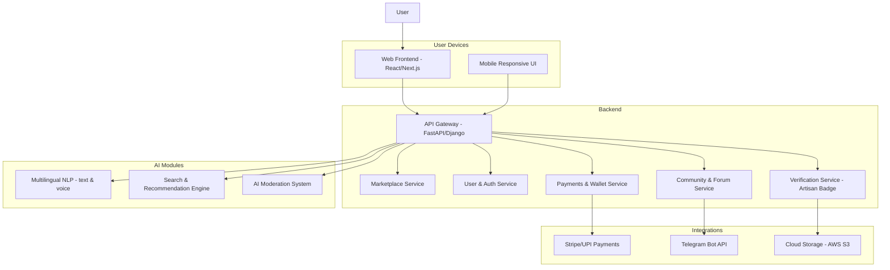

# Pehchaan 🎭

**Empowering Artisans, Connecting Communities, and Building Trust.**

Pehchaan is a multi-usable marketplace platform where **artisans and small businesses** showcase their products, verified with a **Verified Artisan Badge**, and users can **explore, buy, and engage in multiple languages with text/voice support**.
This platform goes beyond e-commerce – it builds **community trust**, **storytelling**, and **sustainability**.

---

## 🌟 Key Features

* **Multi-Language Support** (text + voice inputs)
* **AI-powered Search & Recommendations** (personalized marketplace experience)
* **Verified Artisan Badge** (trust layer for authenticity)
* **Marketplace with Storytelling** (product listings + artisan stories)
* **Community Angle 🤝** (forums, discussions, support groups)
* **Telegram Support Bot** (basic help & updates, expandable to WhatsApp later)
* **Smart Filters & Categories** (region, art type, material, eco-friendly, trending)
* **Secure Payments & Wallet** (Stripe/UPI integration)
* **AI Moderation** (fake listings, scam prevention, abusive content filter)
* **Accessibility First** (voice navigation, text-to-speech, readable fonts)

---

## 🏗️ System Architecture

---

## 🔄 Workflow of Website

1. **User Onboarding**

   * Sign up/login via email, phone, or social login
   * Select preferred language
   * Option to enable voice commands

2. **Marketplace Browsing**

   * Explore by category, artisan, trending tags
   * AI-powered recommendations
   * Storytelling section for each artisan

3. **Artisan Verification & Badging**

   * Artisans upload ID + proof of authenticity
   * Admin/AI verifies → Assigns **Verified Artisan Badge**

4. **Buying & Payments**

   * Add to cart → Secure checkout via Stripe/UPI
   * Wallet system for refunds/rewards

5. **Community Angle 🤝**

   * Forum for artisans & buyers
   * Product discussions, Q\&A, sustainability tips

6. **Support**

   * Telegram bot integration (order updates, FAQs)
   * Future WhatsApp expansion

7. **Admin Dashboard**

   * Manage artisans, badges, products
   * Moderation (AI + manual review)
   * Analytics & reports

---

## 🛠️ Tech Stack

* **Frontend**: Next.js (React, TailwindCSS, i18n for multilingual)
* **Backend**: FastAPI (Python) / Django REST Framework
* **Database**: PostgreSQL (relational) + Redis (caching)
* **AI/NLP**: Hugging Face models (translation, voice-to-text, search ranking)
* **Integrations**: Stripe, UPI, Telegram Bot API
* **Deployment**: Docker + Kubernetes (scalable), Vercel (frontend), AWS (backend)

---

## 📦 Modules Breakdown

### 1. Frontend (Next.js + Tailwind)

* Landing page + artisan stories
* Marketplace UI (filter, search, recommendations)
* Voice input + text-to-speech integration

### 2. Backend (FastAPI/Django)

* Authentication & User Management
* Marketplace CRUD APIs
* Artisan Verification APIs
* Payment Gateway Integration
* Forum/Community APIs

### 3. AI Modules

* Multilingual text/voice handling (translation + TTS/STT)
* AI search & product recommendation engine
* Moderation for scams/spam content

### 4. Integrations

* Telegram Support Bot
* Payment API (Stripe/UPI)
* Cloud storage for artisan product media

---

## 🚀 Future Roadmap

* Expand **support to WhatsApp**
* Build **mobile app version** (React Native)
* Add **loyalty/rewards system**
* Expand **AI storytelling generator** (auto-generate artisan bios)
* Partner with **NGOs for rural artisan onboarding**

👉 Bro, do you want me to **now break this README into GitHub issue-style tasks (frontend, backend, AI, integrations)** so you can directly start development in chunks?

