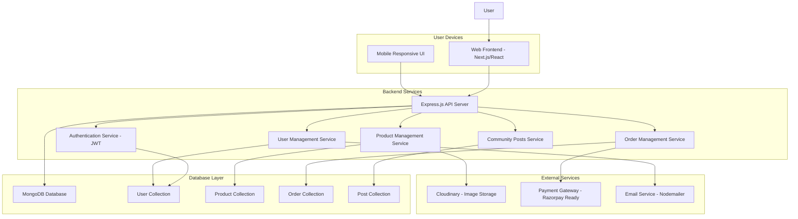

# Pehchaan 🎭

**Empowering Artisans, Connecting Communities, and Building Trust.**

Pehchaan is a multi-usable marketplace platform where **artisans and small businesses** showcase their products, verified with a **Verified Artisan Badge**, and users can **explore, buy, and engage in multiple languages with text/voice support**.
This platform goes beyond e-commerce – it builds **community trust**, **storytelling**, and **sustainability**.

---

## 🌟 Key Features

### ✅ Implemented Features
* **Multi-Language Support** (English/Hindi with translation system)
* **Marketplace with Product Management** (browse, filter, search products)
* **Community Forum** (posts, comments, likes, sharing)
* **User Authentication** (JWT-based with refresh tokens)
* **Role-based Access** (Buyer/Artisan dashboards)
* **Product Management** (CRUD operations, categories, inventory)
* **One-Click Product Listing** (frontend ready, backend integration pending)
* **Order Management** (order creation, status tracking)
* **Smart Filters & Categories** (region, art type, material, price)
* **Responsive Design** (mobile-first approach)
* **Shopping Cart** (add/remove items, quantity management)
* **🚀 AI-powered social media content generation** (frontend implemented, backend coming soon)
* **🚀 Video generation with Veo AI for marketing and social media** (frontend implemented, backend coming soon)
* **🚀 Smart price prediction for artisans** (frontend implemented, backend coming soon)
* **🚀 Competitor analysis option integration in artisan dashboard** (frontend implemented, backend coming soon)

### 🔧 Technical Features
* **JWT Authentication** (secure user sessions)
* **MongoDB Database** (scalable data storage)
* **RESTful API** (clean backend architecture)
* **TypeScript** (type-safe development)

### 📋 Demo Features
* **Product Showcase** (browse and filter handcrafted products)
* **One-Click Listing** (easy product upload interface)
* **Community Interaction** (posts, comments, and discussions)
* **User Roles** (separate dashboards for buyers and artisans)
* **Multilingual Interface** (English/Hindi support)
* **Responsive Design** (works on all devices)


---

## 🏗️ System Architecture



---

## 🔄 Workflow of Website

1. **User Onboarding**

   * Sign up/login via email, phone, or social login
   * Select preferred language
   * Option to enable voice commands

2. **Marketplace Browsing**

   * Explore by category, artisan, trending tags
   * AI-powered recommendations
   * Storytelling section for each artisan

3. **Artisan Verification & Badging**

   * Artisans upload ID + proof of authenticity
   * Admin/AI verifies → Assigns **Verified Artisan Badge**

4. **Buying & Payments**

   * Add to cart → Secure checkout via Stripe/UPI
   * Wallet system for refunds/rewards

5. **Community Angle 🤝**

   * Forum for artisans & buyers
   * Product discussions, Q\&A, sustainability tips

6. **Support**

   * Telegram bot integration (order updates, FAQs)
   * Future WhatsApp expansion

7. **Admin Dashboard**

   * Manage artisans, badges, products
   * Moderation (AI + manual review)
   * Analytics & reports

---

## 🛠️ Tech Stack

* **Frontend**: Next.js 13 (React, TypeScript, TailwindCSS, Radix UI)
* **Backend**: Node.js + Express.js + MongoDB
* **Database**: MongoDB (NoSQL) with Mongoose ODM
* **State Management**: Zustand
* **UI Components**: Radix UI + Tailwind CSS
* **HTTP Client**: TanStack Query (React Query)
* **Authentication**: JWT-based with refresh tokens
* **File Upload**: Multer (Cloudinary integration ready)
* **Validation**: Joi + Express Validator
* **Security**: Helmet, CORS, Rate Limiting
* **Deployment**: Ready for Vercel (frontend) + Railway/Heroku (backend)

---

## 📦 Modules Breakdown

### 1. Frontend (Next.js + TypeScript)

* **Landing Page**: Hero section, featured products, artisan showcase
* **Marketplace**: Product browsing, filtering, search, product details
* **Community**: Posts, discussions, user interactions
* **Dashboard**: Artisan and buyer dashboards with analytics
* **Authentication**: Login/signup modals with form validation
* **Cart & Checkout**: Shopping cart and order placement
* **Multilingual**: English/Hindi translation support

### 2. Backend (Node.js + Express)

* **Authentication**: JWT-based auth with refresh tokens, user registration/login
* **User Management**: Profile management, role-based access (buyer/artisan)
* **Product Management**: CRUD operations, categories, inventory management
* **Order Management**: Order creation, status tracking, payment processing
* **Community**: Post creation, comments, likes, sharing
* **File Upload**: Image upload with Multer (Cloudinary ready)
* **Validation**: Input validation with Joi and Express Validator

### 3. Database (MongoDB)

* **User Collection**: User profiles, authentication, artisan details
* **Product Collection**: Product information, images, pricing, inventory
* **Order Collection**: Order details, payment info, shipping, timeline
* **Post Collection**: Community posts, comments, interactions

### 4. External Integrations (Ready/Planned)

* **Cloudinary**: Image storage and management
* **Razorpay**: Payment gateway integration (ready for implementation)
* **Nodemailer**: Email notifications (ready for implementation)
* **Telegram Bot**: Support bot (planned)

---

## 🚀 Quick Start

### Prerequisites
- Node.js (v16 or higher)
- MongoDB (local or MongoDB Atlas)
- npm or yarn

### Frontend Setup
```bash
# Install dependencies
npm install

# Start development server
npm run dev

# Build for production
npm run build
npm start
```

### Backend Setup
```bash
# Navigate to backend directory
cd backend

# Install dependencies
npm install

# Copy environment file
cp env.example .env

# Update .env with your configuration
# MONGODB_URI=mongodb://localhost:27017/pehchaan
# JWT_SECRET=your-secret-key
# FRONTEND_URL=http://localhost:3000

# Start development server
npm run dev

# Or start production server
npm start
```

### Environment Variables
Create a `.env` file in the backend directory:
```env
NODE_ENV=development
PORT=5000
FRONTEND_URL=http://localhost:3000
MONGODB_URI=mongodb://localhost:27017/pehchaan
JWT_SECRET=your-super-secret-jwt-key
JWT_EXPIRE=7d
CLOUDINARY_CLOUD_NAME=your-cloudinary-name
CLOUDINARY_API_KEY=your-cloudinary-key
CLOUDINARY_API_SECRET=your-cloudinary-secret
```

---

## 📚 API Documentation

### Base URL
```
http://localhost:5000/api
```

### Authentication Endpoints
| Method | Endpoint | Description | Access |
|--------|----------|-------------|---------|
| POST | `/auth/register` | Register new user | Public |
| POST | `/auth/login` | Login user | Public |
| POST | `/auth/refresh` | Refresh access token | Public |
| POST | `/auth/logout` | Logout user | Private |

### Product Endpoints
| Method | Endpoint | Description | Access |
|--------|----------|-------------|---------|
| GET | `/products` | Get all products | Public |
| GET | `/products/:id` | Get single product | Public |
| GET | `/products/search` | Search products | Public |
| POST | `/products` | Create product | Private (Artisan) |
| PUT | `/products/:id` | Update product | Private (Owner) |

### Order Endpoints
| Method | Endpoint | Description | Access |
|--------|----------|-------------|---------|
| POST | `/orders` | Create order | Private |
| GET | `/orders` | Get user orders | Private |
| GET | `/orders/:id` | Get single order | Private |
| PUT | `/orders/:id/cancel` | Cancel order | Private |

### Community Endpoints
| Method | Endpoint | Description | Access |
|--------|----------|-------------|---------|
| GET | `/posts` | Get all posts | Public |
| POST | `/posts` | Create post | Private |
| GET | `/posts/:id` | Get single post | Public |
| POST | `/posts/:id/like` | Like post | Private |
| POST | `/posts/:id/comment` | Comment on post | Private |

---

## 📁 Project Structure

```
pehchaan/
├── app/                          # Next.js 13 App Router
│   ├── page.tsx                  # Homepage
│   ├── layout.tsx                # Root layout
│   ├── globals.css               # Global styles
│   ├── marketplace/              # Marketplace pages
│   ├── community/                # Community pages
│   ├── dashboard/                # Dashboard pages
│   ├── cart/                     # Cart page
│   ├── checkout/                 # Checkout page
│   └── product/[id]/             # Product detail pages
├── components/                   # React components
│   ├── ui/                       # Reusable UI components (Radix UI)
│   ├── auth/                     # Authentication components
│   ├── marketplace/              # Marketplace-specific components
│   ├── community/                # Community components
│   ├── dashboard/                # Dashboard components
│   ├── layout/                   # Layout components (Navbar, etc.)
│   └── theme/                    # Theme and styling components
├── lib/                          # Utility libraries
│   ├── api.ts                    # API client functions
│   ├── store.ts                  # Zustand state management
│   ├── translations.ts           # i18n translations
│   └── utils.ts                  # Utility functions
├── hooks/                        # Custom React hooks
├── backend/                      # Node.js/Express backend
│   ├── models/                   # MongoDB models
│   │   ├── User.js               # User schema
│   │   ├── Product.js            # Product schema
│   │   ├── Order.js              # Order schema
│   │   └── Post.js               # Community post schema
│   ├── routes/                   # API routes
│   │   ├── auth.js               # Authentication routes
│   │   ├── users.js              # User management routes
│   │   ├── products.js           # Product routes
│   │   ├── orders.js             # Order routes
│   │   ├── posts.js              # Community routes
│   │   └── artisans.js           # Artisan-specific routes
│   ├── middleware/               # Express middleware
│   │   ├── auth.js               # JWT authentication
│   │   └── errorHandler.js       # Error handling
│   ├── server.js                 # Main server file
│   └── package.json              # Backend dependencies
├── package.json                  # Frontend dependencies
├── tailwind.config.ts            # Tailwind CSS configuration
├── tsconfig.json                 # TypeScript configuration
└── README.md                     # This file
```

---

## 📊 Development Status

### Current Version: 1.0.0-beta

**Core Features Implemented:**
- ✅ User authentication and authorization
- ✅ Product management (CRUD operations)
- ✅ Marketplace with filtering and search
- ✅ Community forum with posts and comments
- ✅ Shopping cart and order management
- ✅ Multilingual support (English/Hindi)
- ✅ Responsive design for all devices
- ✅ Role-based dashboards (Buyer/Artisan)
- ✅ AI-powered social media content generation (frontend)
- ✅ Video generation with Veo AI (frontend)
- ✅ Smart price prediction for artisans (frontend)
- ✅ Competitor analysis in artisan dashboard (frontend)

**Backend Ready:**
- 🔧 Express.js API server
- 🔧 MongoDB with Mongoose ODM
- 🔧 JWT authentication system
- 🔧 Input validation and error handling

**Demo Ready:**
- 🎯 Complete marketplace functionality
- 🎯 One-click product listing interface
- 🎯 User authentication and role management
- 🎯 Community forum with interactions
- 🎯 Shopping cart and order flow
- 🎯 Multilingual support
- 🎯 Responsive design for all devices
- 🎯 AI-powered social media content generation
- 🎯 Video generation with Veo AI
- 🎯 Smart price prediction for artisans
- 🎯 Competitor analysis in artisan dashboard

**Future Enhancements:**
- 🔧 Backend integration for AI-powered features
- 🔧 Smart Analytics Dashboard (comprehensive business insights)
- 🔧 Advanced AI model training and optimization

---

## 🎯 Demo Highlights

### What You Can Experience:
1. **Browse Products** - Explore handcrafted items with filtering
2. **One-Click Listing** - Easy product upload interface for artisans
3. **Community Forum** - Create posts, comment, and interact
4. **User Roles** - Switch between buyer and artisan dashboards
5. **Multilingual** - Toggle between English and Hindi
6. **Responsive Design** - Works seamlessly on desktop and mobile
7. **Shopping Cart** - Add items and proceed to checkout
8. **Authentication** - Register, login, and manage profile
9. **AI Social Media** - Generate marketing content with AI
10. **Video Generation** - Create product showcase videos with Veo AI
11. **Price Prediction** - Get AI-powered pricing recommendations
12. **Competitor Analysis** - Analyze market trends and competition

### Perfect for Showcasing:
- ✅ Complete user journey from browsing to checkout
- ✅ Real-time community interactions
- ✅ Professional UI/UX design
- ✅ Mobile-responsive interface
- ✅ Multilingual support for Indian market

---

## 🙏 Acknowledgments

- Built with ❤️ for Indian artisans and craftspeople
- Special thanks to the open-source community
- Inspired by the rich cultural heritage of India

---

**Ready to demo? Follow the [Quick Start Guide](#-quick-start) above!** 🚀

